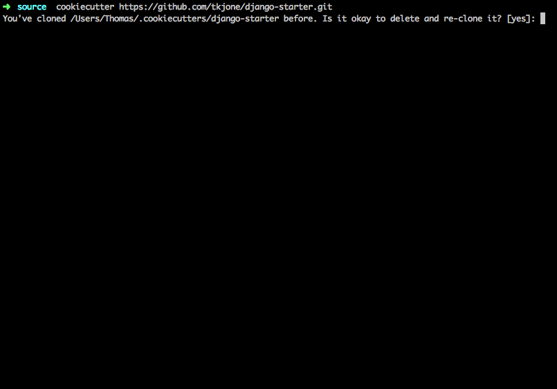

**************
Django Starter
**************

Welcome to Django Starter, a cookiecutter template for Django Projects.

Overview
========

Django Starter provides you with a flexible starting point for your Django project.  Included in this template is a Django development environment provided by vagrant, a project layout based on pydanny's `cookiecutter django`_ and `Two Scoops of Django`_ and a lean set of dependencies.  The goal is to provide you with everything you need to quickly and easily start a new Django project.

Django Starter uses a scaffolding tool called `cookiecutter`_.  Cookiecutter is similar to `Yeoman`_.  These tools are used to build out entire projects for you instead of you having to create files manually and modify their configurations.

.. _cookiecutter django: https://github.com/pydanny/cookiecutter-django
.. _Two Scoops of Django: https://www.twoscoopspress.com/products/two-scoops-of-django-1-8
.. _Yeoman: http://yeoman.io/
.. _cookiecutter: https://cookiecutter.readthedocs.org/en/latest/index.html

Quick Start
===========

1. Install Cookiecutter

* OSX
   .. code-block:: bash

       brew install cookiecutter

* Linux + Windows
   .. code-block:: bash

       pip install cookiecutter

2. Build your Django project based on django-starter

   .. code-block:: bash

       cookiecutter https://github.com/tkjone/django-starter.git

You are going to be prompted to answer some questions about your project and the answers you provide are used build and configure your it.  These questions are called `prompts`  If you leave a `prompts` blank, Cookiecutter will use the default answer in the square brackets.  For a list of the prompts used by this template, pleasse see the `prompts documentation`_

For example, let us pretend your a huge fan of Taye Diggs and you want to make a website celebrating his life.  This is how that would look:

Out of the Box
==============

The `django-starter` provides you with the following feature set:

* Django 1.9.x

* Vagrant Setup - Ubuntu 14.04

    This includes a 100% configured Vagrantfile with a Ubuntu 14.04 vagrant box.

* Provisioning Scripts

    Shell scripts to automate the configuration of your vagrant box, setup your virtualenvironments, initialize and migrate your projects database, install Django dependencies and create project superuser.

* Multiple virtualenvironments

    The provisioning scripts will provide you with two virtualenvironments.  One uses Python 2 and the other uses Python 3.  No configuration required, no changes to the Ubuntu default version of Python, just switch between one or the other using virtualenvwrappers `workon` command

* 12 Factor App

    Project is inspired by `12 factor app`_ which means it comes configured to use environment variables, database connection strings and other methodologies outlined in the 12 Factor manifesto.  Each one has defaults, which means you don't have to setup a `.env` or export variables to start development work.

* Multiple database choices (Postgres or sqlite)

    Are you working on a Proof of Concept and don't need a full blown database?  No worries, this project gives you the choice of sqlite or postgres and everything will be configured accordingly.

* lean project layout - no apps, minimal base template

    This project tries to provide a lean project layout.  No apps.  Only a single, unstyled template.

* Configured dev setup

    Providing you with some essential tools to get you up and running.  This includes:

    * django-extensions
    * django-nose
    * coverage
    * django-debug-toolbar

* Collaboration - dotfiles and documentation structure

    Documentation is important, django-starter provides you with a basic documentation structure that and dot-files for improved collaboration.

.. _12 factor app: http://12factor.net/

Constraints
===========

* Vagrant setup tested on Linux and OSX

    Project has not yet been tested on Windows OS.

* Postgres 9.0 or sqlite

    While you can configure this project to use other databases, I only provide configurations for Postgres and sqlite at this moment.

* Environment Variables (these won't work with Apache/mod_wsgi)

Deeper Dive
===========

Check out `django starters`_ for a step by step guide that explains this project in great detail.  Django Starters is built as a learning tool to help early and intermediate django developers get a better understanding, through practical application, of how to setup and configure a Django project.

.. _django starters: https://github.com/tkjone/django-starters

Contributing
============

I am a believer in the community creating things together. If you are reading through anything I have written here and find that it is incorrect, outdated or lacking in proper documentation, please feel free to create an issue or fork this repo and make a PR.

Branches
--------

This repo's branches correspond to the version of Django being used.  This project will always default to the latest version of Django and the branches will follow the `django roadmap`_.  Thus, the next branch will be `django-starter-1.10.x`

.. _django roadmap: https://www.djangoproject.com/weblog/2015/jun/25/roadmap/
.. _prompts documentation: https://github.com/tkjone/django-starter/blob/django-starter-1.9.x/docs/prompts.rst

